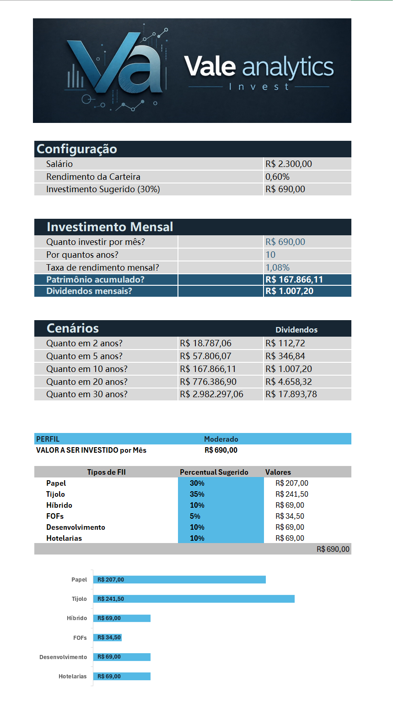

# Simulador de Investimentos em Fundos Imobiliários

Ferramenta de simulação de investimentos em Fundos Imobiliários (FIIs), desenvolvida em Excel como parte de um desafio prático da DIO.

O projeto tem como objetivo transformar parâmetros simples de investimento em uma visão projetada de **aporte mensal, patrimônio acumulado e dividendos**, além de apresentar uma sugestão de distribuição da carteira de acordo com diferentes perfis de investidor.

> **Projeto educacional:** os valores e projeções apresentados são utilizados exclusivamente para fins de estudo e simulação. Não constituem recomendação de investimento.

---

## Sobre o projeto

O desafio propõe a criação de uma ferramenta prática em Excel capaz de auxiliar na simulação de investimentos em FIIs, considerando variáveis como valor investido, prazo e taxa de rendimento.

A solução desenvolvida busca automatizar esses cálculos e apresentar os resultados de forma visual e organizada.

### Principais funcionalidades

* Definição do salário mensal;
* Cálculo de uma proposta de aporte mensal;
* Definição da taxa de rendimento mensal;
* Simulação de diferentes períodos de investimento;
* Projeção do patrimônio acumulado;
* Estimativa de dividendos mensais;
* Comparação de cenários de longo prazo;
* Distribuição do aporte entre diferentes tipos de FIIs;
* Seleção de perfil de investidor;
* Visualização gráfica da distribuição da carteira.

---

## Estrutura da planilha

### Carteira

A aba **Carteira** concentra a simulação financeira.

Nela são definidos os principais parâmetros utilizados nos cálculos:

* Salário;
* Percentual destinado ao investimento;
* Aporte mensal;
* Taxa de rendimento;
* Período de investimento.

A partir desses parâmetros, a planilha apresenta projeções de patrimônio e dividendos.

Também são apresentados diferentes cenários de prazo para visualizar o efeito dos juros compostos ao longo do tempo.

### Perfis

A aba **Perfis** apresenta uma proposta de distribuição do aporte mensal de acordo com o perfil selecionado.

Os tipos de FIIs considerados no modelo são:

* Papel
* Tijolo
* Híbrido
* FOFs
* Desenvolvimento
* Hotelarias

A distribuição percentual é convertida automaticamente em valores monetários a partir do aporte mensal definido na simulação.

---

## Principais cálculos

Entre os recursos utilizados na construção da ferramenta estão:

* Operações matemáticas;
* Percentuais;
* Referências entre células;
* Nomes definidos no Excel;
* Função `FV` para projeção do valor futuro;
* Funções de busca para relacionamento entre parâmetros e resultados;
* `SUM` para consolidação dos valores;
* Gráficos para representação visual dos dados.

Um dos cálculos utilizados para a projeção do patrimônio é baseado na função:

```excel
=FV(Taxa,Anos*12,Aporte)*-1
```

A utilização de nomes definidos como `Salario`, `Rendimento`, `Proposta`, `Aporte`, `Anos` e `Taxa` contribui para tornar as fórmulas mais legíveis e facilitar a manutenção da planilha.

---

## Demonstração

Confira uma demonstração da ferramenta desenvolvida em Excel:

[](assets/demo.mp4)

> Clique na imagem para assistir à demonstração completa da planilha.

---

## Preview



---

## Tecnologias e ferramentas

* Microsoft Excel
* Fórmulas financeiras
* Modelagem de dados em planilha
* Gráficos
* Git
* GitHub
* Markdown

---

## Estrutura do repositório

```text
simulador-investimentos-fii-excel/
│
├── README.md
├── Controle_de_Investimento_FII.xlsx
├── .gitignore
│
└── assets/
    ├── demo.mp4
    └── preview.png
```

---

## Objetivos de aprendizagem

Este projeto foi desenvolvido com foco na aplicação prática de conceitos de Excel, incluindo:

* Construção de ferramentas de simulação;
* Aplicação de cálculos financeiros;
* Utilização de funções e referências;
* Organização de dados;
* Criação de visualizações;
* Documentação técnica;
* Versionamento e publicação de projetos utilizando GitHub.

---

## Contexto

Este projeto faz parte de um desafio prático da **DIO**, cujo objetivo é desenvolver uma ferramenta de simulação de investimentos em fundos imobiliários utilizando Excel e documentar o trabalho em um repositório público no GitHub.

---

## Autor

**Lúcio do Vale**

Projeto desenvolvido para fins de aprendizado e construção de portfólio em análise de dados, Excel e Business Intelligence.
